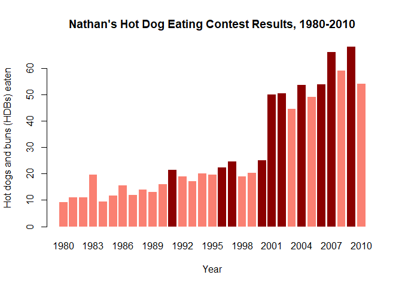
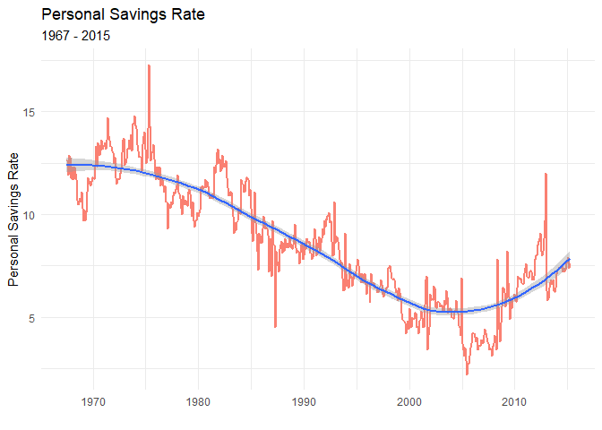

Visual Analytics Module 10 -Time Series and Visualization
================

``` r
library(readr)
library(ggplot2)
hotdogs <- read_csv("http://datasets.flowingdata.com/hot-dog-contest-winners.csv")
```

    ## Parsed with column specification:
    ## cols(
    ##   Year = col_double(),
    ##   Winner = col_character(),
    ##   `Dogs eaten` = col_double(),
    ##   Country = col_character(),
    ##   `New record` = col_double()
    ## )

This weeks assignment is more practice with r plots and ggplot2, this time including time series plots. Below, I have created:

Regular r barplot for Nathan's Hot Dog Eating Contest:

``` r
colors <- ifelse(hotdogs$`New record` == 1, "darkred", "salmon")
barplot(hotdogs$`Dogs eaten`, names.arg = hotdogs$Year, col=colors, border=NA,
main = "Nathan's Hot Dog Eating Contest Results, 1980-2010",  xlab="Year", ylab="Hot dogs and buns (HDBs) eaten",)
```



This graph shows the number of hotdogs eaten per year for Nathan's Hot Dog Contest. New records are denoted with a darker tone. This is a simple yet effective graph and the use of a barchart is a good idea when dealing with discrete data like number of hot dogs eaten and years.

ggplot2 time series line plot for Nathan's Hot Dog Eating Contest:

``` r
ggplot(hotdogs, aes(x = hotdogs$Year, y = hotdogs$`Dogs eaten`)) + geom_line(color = "salmon", size=2 ) +geom_smooth() + labs(title = "Nathan's Hot Dog Eating Contest", subtitle = "1980-2010", x = "Year", y = "Hot Dogs and Buns Eaten") + theme_minimal()
```

    ## `geom_smooth()` using method = 'loess' and formula 'y ~ x'


This plot is less specific with displaying the specific numbers of hot dogs eaten, however it is better at showing possible trends and the curvature of the graph and whether it is skewed or abnormal.

Time Series Line Plot for r dataset 'economics':

``` r
library(ggplot2)
library(scales)
```

    ## 
    ## Attaching package: 'scales'

    ## The following object is masked from 'package:readr':
    ## 
    ##     col_factor

``` r
ggplot(economics, aes(x = date, y = psavert)) +geom_line(color = "salmon", size=1 ) + geom_smooth()  + labs(title = "Personal Savings Rate", subtitle = "1967 - 2015", x = "", y = "Personal Savings Rate") +theme_minimal()
```

    ## `geom_smooth()` using method = 'loess' and formula 'y ~ x'



This last graph shows the personal savings rate for the years 1967-2015 using the default r 'economics' dataset. I believe this is a very neat, concise and effective graph that is useful for seeing trends and the curve of the graph.
